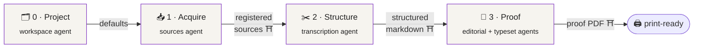
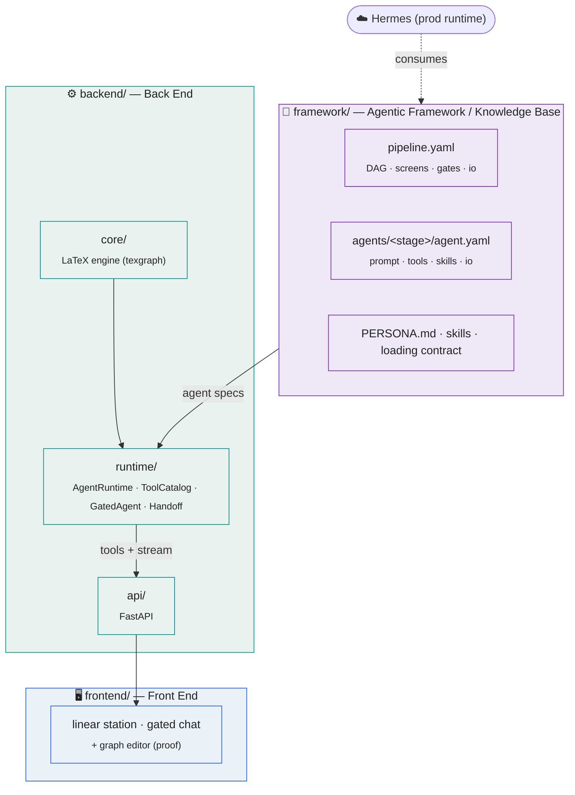

<div align="center">

# ✦ Texgraph ✦

### an AI-agent-operated workstation for making books

*Turn a public-domain PDF into a print-ready, fine-press critical edition — one
guided screen at a time, each with a specialist agent at your shoulder.*


</div>

---

> **The short version.** Republishing neglected public-domain literature to a
> fine-press standard is slow, fiddly, expert work: acquire a clean scan, strip the
> library cruft, transcribe verse without mangling its lineation, then typeset a proof
> that respects the page. Texgraph turns that pipeline into a **browser station** where
> every stage is a screen backed by a **chat agent gated to that stage** — and the
> agents do real work, not suggestions. The reference tenant is *St. Expedite Press*'s
> edition of **John Gould Fletcher's early works**.

## Contents

- [What this is](#-what-this-is) · [The station](#-the-station) · [Architecture](#-architecture--three-portions)
- [Two agent worlds](#-two-agent-worlds) · [How a gated agent is assembled](#-how-a-gated-agent-is-assembled)
- [The pipeline](#-the-pipeline) · [Quickstart](#-quickstart) · [Repository layout](#-repository-layout)
- [Command surface](#-command-surface) · [Skill & Tool Loading Contract](#skill--tool-loading-contract)
- [Status & roadmap](#-status--roadmap) · [Reference](#-reference--repository-map)

---

## ✦ What this is

Texgraph is two things wearing one repository:

1. **A product** — an opinionated, agent-guided **publishing station**. You bring a
   public-domain text; the station walks you from *project* → *acquire* → *structure*
   → *proof*, and at each screen a **specialist agent** (scoped to exactly that job)
   chats with you and operates the real tools. The differentiator is the last screen:
   **populate and compile a proof, conversationally**, using everything decided
   upstream as the jumping-off point.

2. **A press** — the system is proven by actually shipping editions. The flagship is
   *The Early Works of John Gould Fletcher* (five self-financed 1913 London books, 276
   poems), set on crème Royal 8vo with a measured-height, one-poem-per-page interior
   and a print-ready PDF/X.

The engine underneath is a **Markdown → LuaLaTeX → PDF/X** pipeline; the intelligence
on top is a fleet of **gated agents** that run on **Hermes** in production.

## ✦ The station

Four linear screens (the graph/card editor is kept as the stage-3 proofing power-tool).
Each screen is one **gated specialist agent** + that stage's artifact view; each arrow
is a **user-approved gate** (`PROMOTION.yaml`) that hands the prior screen's outputs
forward.



| # | Screen | Agent does | Produces | Gate |
|---|--------|-----------|----------|------|
| 0 | **Project** | set title, author, imprint, trim defaults | project + `collection.yaml` defaults | — |
| 1 | **Acquire** | find/upload PDF, verify, clear rights, rename + provenance | registered sources | `sources/PROMOTION.yaml` |
| 2 | **Structure** | strip front/back-matter dross, map pages, transcribe verse, build the markdown tree | structured Markdown + plan | `transcription/PROMOTION.yaml` |
| 3 | **Proof** | relineate + note (editorial) · set layout, build & visually review the proof (typeset) | proof PDF | `interior/PROMOTION.yaml` |

## ✦ Architecture — three portions



| Portion | Is | Holds |
|---|---|---|
| **`framework/`** | runtime-agnostic agent definitions + knowledge (loads onto Hermes) | `pipeline.yaml`, `agents/<stage>/agent.yaml`, `PERSONA.md`, the loading contract |
| **`backend/`** | the engine + API + agent runtime | `core/` (LaTeX pipeline), `api/` (FastAPI), `runtime/` (the agent layer), `cli/`, `tests/` |
| **`frontend/`** | the browser station | linear stage screens + gated chat; graph/card editor for proofing |

## ✦ Two agent worlds

> [!IMPORTANT]
> Texgraph has **two distinct kinds of agent**, and the repo is organized around the
> difference:
>
> | | **Development agent** | **Runtime agents** |
> |---|---|---|
> | who | Claude Code | Hermes (OpenRouter) |
> | charter | root `AGENTS.md` / `CLAUDE.md` | `framework/agents/<stage>/agent.yaml` |
> | job | **build & maintain the whole system**, including its own framework | **operate the station** for end users |
> | scope | the repo | one pipeline stage each, gated |
>
> The development agent writes the runtime agents' definitions; it does not impersonate
> them.

## ✦ How a gated agent is assembled

The keystone idea: an agent for a screen is **composed**, not hand-written. The runtime
reads the stage's spec and grants it *only* what that stage needs — its prompt, its
skills, its tools, and write-access to its own directory.

```mermaid
flowchart LR
    SPEC["agent.yaml<br/><sub>system_prompt · persona</sub>"] --> G{{"GatedAgent<br/>assembler"}}
    SK["skills (by name)<br/><sub>loading contract</sub>"] --> G
    TL["tool allow-list →<br/>ToolCatalog ops"] --> G
    SC["artifact scope<br/><sub>modules/&lt;stage&gt;.artifact_dir</sub>"] --> G
    G --> AG(["🤖 gated stage agent"])
    AG -- "gate approved" --> H["HandoffController"] --> NEXT(["next stage agent<br/><sub>seeded with prior io</sub>"])
    classDef k fill:#f6f4ef,stroke:#7B2CBF,color:#222; class SPEC,SK,TL,SC,G,AG,H,NEXT k;
```

The agent **cannot** call another stage's tools or write another stage's directory — the
allow-list and artifact scope are machine-enforced, and `tools/skill_index.py --check`
verifies every spec's tools resolve to real commands and every named skill exists.

## ✦ The pipeline

Under the screens is a classic gated DAG; each edge is a user-approved `PROMOTION.yaml`.

```mermaid
flowchart LR
    W([workspace]) --> S([sources]) --> T([transcription]) --> M([manuscript]) --> I([interior])
    I --> C([covers]) & PU([publication]) --> R([release])
    classDef d fill:#fff,stroke:#888,color:#333; class W,S,T,M,I,C,PU,R d;
```

| Stage | Owns | Project artifacts |
|---|---|---|
| `workspace` | project registration | `workspace.yaml` |
| `sources` | acquisition, provenance, stable naming | `sources/` |
| `transcription` | poem-per-file transcription from scans | `transcription/` |
| `manuscript` | editorial reading edition, proofing, corrections | `manuscript/reading/` |
| `interior` | typeset proofs and print-ready PDFs | `interior/output/` |
| `covers` · `publication` · `release` | covers · e-book/web · packaging | *(downstream; not yet station screens)* |

## ✦ Quickstart

```bash
# 1. install (editable) + register your workspace
python -m venv .venv && . .venv/Scripts/activate      # POSIX: . .venv/bin/activate
pip install -e ".[studio]"                             # engine + Studio backend
cp workspace.example.yaml workspace.yaml

# 2. drive the engine from the CLI
texgraph list                                          # projects in workspace.yaml
texgraph proof-build  --project fletcher-early-works   # build the reference proof
texgraph proof-preview --project fletcher-early-works  # render key pages to PNG
texgraph verify-coverage --project fletcher-early-works

# 3. dev loops (keep these green)
python -m pytest -q
python tools/skill_index.py --check                    # skill + agent-spec contract gate
```

**External tools:** a LuaLaTeX install (TeX Live) for builds; **poppler**
(`pdftoppm`, `pdftotext`, `pdfinfo`) for `pdf` / `proof-preview`.

## ✦ Repository layout

```
CLAUDE.md / AGENTS.md   development-agent charter (build & maintain the system)
README.md               this file — the comprehensive doc + repo map
framework/              🧠 agentic framework / knowledge base (runtime-agnostic)
  pipeline.yaml           DAG → screens, gates, hand-off io contracts
  agents/<stage>/agent.yaml   per-stage gated agent specs
  PERSONA.md              editorial house-voice register
backend/                ⚙️ back end
  core/                   the LaTeX engine (import root: backend.core)
  api/                    FastAPI product API (package: app)
  runtime/                gated agent runtime: ToolCatalog · GatedAgent · AgentRuntime · adapters · handoff
  tests/                  pytest suite
frontend/               🖥️ React + Vite station
modules/<stage>/        backend stage contracts: AGENTS.md, module.yaml, RUNBOOK, schemas, skills
tools/                  dev maintenance: ontology_check.py, skill_index.py, …
projects/<id>/          tenant data; fletcher-* = reference tenant / golden test
```

## ✦ Command surface

| Command | Purpose |
|---|---|
| `proof-build [--config <sheet>] [--print-ready]` | omnibus interior pipeline → review proof, trim variant, or even-page PDF/X |
| `proof-preview [--config <sheet>] [--pages] [--sample]` | render structural pages to PNG for visual review (poppler) |
| `verify-coverage` | prove every transcription poem maps 1:1 to a built reading poem |
| `build` · `watch` · `list` · `new poem` | full build · auto-rebuild · list projects · scaffold a poem |
| `verify <stage>` · `promote <stage>` | check / approve a pipeline gate |
| `audit` · `metadata` · `scan` · `plan` · `page-map` | transcription audit, `book.json`, source scan, plan/page mapping |
| `pdf info/text/render` · `archive files/download` · `ingest rename` · `studio` | PDF inspection · Internet Archive · source intake · review UI |

Full flags, schemas, and the Studio API are in the [Reference](#-reference--repository-map).

---

## Skill & Tool Loading Contract

Context loads **lazily and by relevance**. A development agent — and each runtime agent —
opens only the `SKILL.md` files and tools its job needs, never the whole surface. Every
skill and every `agent.yaml` declares its `tools` (the commands it drives), and
`tools/skill_index.py` generates the index below and enforces the contract:

```bash
python tools/skill_index.py --check    # CI gate: frontmatter + agent specs + index in sync
python tools/skill_index.py --write    # regenerate after editing a skill or agent spec
```

<!-- SKILL-INDEX:START — generated by tools/skill_index.py; do not edit by hand -->

Load **only** the row(s) for the module your classified job targets: open that skill's `SKILL.md` and use only its listed tools. Do not preload other modules' skills or the full command surface.

| Module | Skill | Load it when… | Tools it uses |
|---|---|---|---|
| `sources` | [`source-intake`](../../modules/sources/skills/source-intake/SKILL.md) | Use when adding raw PDFs, checking source availability, running pdfinfo, recording page counts, refreshing source mat… | `texgraph pdf info`, `texgraph pdf text`, `texgraph pdf render`, `texgraph archive files`, `texgraph archive download`, `texgraph ingest rename`, `texgraph scan`, `texgraph verify sources` |
| `transcription` | [`poem-transcription`](../../modules/transcription/skills/poem-transcription/SKILL.md) | Use when filling one poem per Markdown file, preserving lineation and indentation, normalizing drop caps, handling mu… | `texgraph new poem`, `texgraph audit`, `texgraph pdf render`, `texgraph pdf text` |
| `transcription` | [`project-planning`](../../modules/transcription/skills/project-planning/SKILL.md) | Use when editing files under projects/<project_id>/transcription/project_plan/, combining planning documents, adding … | `texgraph plan` |
| `transcription` | [`prose-transcription`](../../modules/transcription/skills/prose-transcription/SKILL.md) | Use for type: prose files, paragraph-based transcription, blockquote handling, and source paratext front matter | `texgraph new poem`, `texgraph audit`, `texgraph pdf text` |
| `transcription` | [`source-matter`](../../modules/transcription/skills/source-matter/SKILL.md) | Use when handling dedications, prefaces, contents pages, acknowledgments, illustration lists, epigraphs, colophons, p… | `texgraph scan`, `texgraph pdf text` |
| `transcription` | [`volume-planning`](../../modules/transcription/skills/volume-planning/SKILL.md) | Use when deriving contents, poem order, page offsets, batch ranges, source-page mappings, source front/back matter ha… | `texgraph plan`, `texgraph scan`, `texgraph page-map`, `texgraph metadata` |
| `manuscript` | [`persona-editorial`](../../modules/manuscript/skills/persona-editorial/SKILL.md) | Use when drafting introductions, afterwords, institutional copy, interpretive framing, or structural plans that shoul… | `(none)` |
| `manuscript` | [`poetry-proof`](../../modules/manuscript/skills/poetry-proof/SKILL.md) | Use for line-break fidelity, stanza correspondence, indentation accuracy, long-line and run-over handling, cycle stru… | `texgraph audit`, `texgraph pdf render`, `texgraph proof-preview` |
| `manuscript` | [`prose-proof`](../../modules/manuscript/skills/prose-proof/SKILL.md) | Use for paragraph integrity, quotation mark normalization, correct type tagging, and front matter field accuracy in p… | `texgraph audit`, `texgraph pdf render` |
| `manuscript` | [`transcription-verification`](../../modules/manuscript/skills/transcription-verification/SKILL.md) | Use when checking poem/source-matter statuses, source-page spans, forbidden markup, poem counts, checklist completion… | `texgraph audit`, `texgraph metadata`, `texgraph verify-coverage` |
| `interior` | [`poetry`](../../modules/interior/skills/poetry/SKILL.md) | Use when configuring stanza spacing, line environment, poem title display, indentation, long-line handling, or cycle … | `texgraph proof-build`, `texgraph proof-preview` |
| `interior` | [`prose`](../../modules/interior/skills/prose/SKILL.md) | Use for paragraph spacing, quotation/epigraph blocks, section headings, and verifying that prose content renders corr… | `texgraph proof-build`, `texgraph proof-preview` |
| `interior` | [`typesetting`](../../modules/interior/skills/typesetting/SKILL.md) | Use for collection.yaml setup, render_config parameter selection (trim size, margins, fonts, leading), PDF/X build ve… | `texgraph proof-build`, `texgraph proof-preview`, `texgraph build`, `texgraph watch` |
| `machinery` | [`repo-maintenance`](../../machinery/skills/repo-maintenance/SKILL.md) | Use when adding folders, scaffolding projects, updating documentation or metadata, standardizing filenames, editing A… | `texgraph modules list`, `texgraph migrate modules` |
| `machinery` | [`skill-improvement-loop`](../../machinery/skills/skill-improvement-loop/SKILL.md) | Review and improve repo-local skills after each task. Use at the end of every task in this repo to assess whether AGE… | `tools/skill_index.py` |
| `machinery` | [`task-classifier`](../../machinery/skills/task-classifier/SKILL.md) | Use when the job type of an incoming request is unclear | `(none)` |
| `machinery` | [`technical-docs`](../../machinery/skills/technical-docs/SKILL.md) | Use when changing directory structure, file formats, CLI commands, data schemas, or pipeline edges requires documenta… | `tools/ontology_check.py`, `tools/skill_index.py` |
| `machinery` | [`tooling`](../../machinery/skills/tooling/SKILL.md) | Use when creating, running, or updating stage tools, enforcing the repo .venv, wiring stage skills to helpers for PDF… | `tools/ontology_check.py`, `tools/skill_index.py` |

<!-- SKILL-INDEX:END -->

## ✦ Status & roadmap

The system is mid-reform into the three-portion architecture above.

- [x] **Phase 1 — Restructure** into `framework/` · `backend/` · `frontend/` (green: tests, CLI, gate)
- [x] **Phase 2 — Framework** : `pipeline.yaml` + per-stage `agent.yaml` specs + validation
- [x] **Phase 3 — Runtime (keystone)** : `ToolCatalog` (real tool-calls) + `GatedAgent` + `AgentRuntime` (gating enforced) + `HandoffController` + dev adapter (Anthropic) + Hermes stub — **wired into the FastAPI API** (`/api/agent/stage[s]`); 12 runtime/service tests
- [ ] **Phase 4 — Station front end** : linear screens + gated chat + gate/handoff UX
- [ ] **Phase 5 — Dev-agent charter** : root `CLAUDE.md`/`AGENTS.md`
- [ ] **Phase 6 — End-to-end** : Fletcher tenant runs Project → Proof in the station

The LaTeX engine, the reference Fletcher edition, **and the gated agent runtime** are
built and proven; the station **front end** is the active frontier. Only the production
**Hermes adapter** awaits its integration contract — the dev adapter unblocks all else.

---

# ✦ Reference — Repository Map

<details>
<summary><b>Directory taxonomy, data schemas, full command surface, invariants, dependencies</b> (click to expand)</summary>

### Data schemas (essentials)

- **`collection.yaml`** — per-project build config: `title`, `author`, `content_dir`
  (→ `../manuscript/reading`), `output_dir`, and a `render_config` block (trim,
  margins, `line_spread`, `stanza_skip`, placement knobs). Variant style sheets
  (`collection_<name>.yaml`) build through the same pipeline into `output/proof-<name>/`.
- **Poem Markdown front matter** — `title`, `type` (`poem`/`prose`/`dedication`/…),
  `order`, `source`, optional `part`, `stanza_skip`. Reading-edition poems use the
  three-section body: `## Original Lineation` / `## Editorial Relineation` /
  `## Context Notes` (the parser typesets the relineation when present, else the
  original; context notes become keyed back-matter endnotes).
- **`PROMOTION.yaml`** — the machine-readable gate per stage: `stage`, `status`
  (`pending`/`approved`), and stage-specific evidence. No silent promotions.
- **`modules/<stage>/module.yaml`** — backend stage contract: `id`, `legacy_ids`,
  `artifact_dir`, `upstream`, `promotion_schema`, `commands`, `skills`.
- **`framework/agents/<stage>/agent.yaml`** — runtime agent spec: `stage`, `screen`,
  `module`, `persona`, `gate`, `upstream`, `io {receives, produces}`, `tools`,
  `skills`, `system_prompt`.

### Key invariants

1. **Hand-curated text never lives under a build-written directory.** Reading editions
   live in `manuscript/reading/`; builds consume them read-only and write only under
   `interior/output/`.
2. **A stage writes only its own `artifact_dir`.** Cross-stage writes need explicit
   approval; the runtime enforces this as each agent's artifact scope.
3. **Persona/voice never enters documentary data** — not source text, YAML, manifests,
   audit output, or command summaries.
4. **`PROMOTION.yaml` is the only gate.** No stage proceeds without an approved upstream.
5. **One CLI entrypoint** (`texgraph`, `backend.core.cli`); shared helpers in `utils.py`.
6. **Contracts-only `modules/`** (AGENTS, module.yaml, RUNBOOK, schemas, skills — never
   runtime code); all code in `backend/`.
7. **Skills & tools load by relevance** (the loading contract); `agent.yaml` tool
   allow-lists and skill references are machine-validated.
8. **Content is flat within a section** — a `.md` nested below section level is a hard
   build error.
9. **Placement is decided by measured page height in TeX**, never a Python line-count proxy.
10. **Visual proof review is mandatory** before interior sign-off — never approve from
    the `.tex` alone.

### Dependency map

- **Engine:** `python-frontmatter`, `mistune`, `jinja2`, `pyyaml`, `typer`, `rich`,
  `watchdog`, `pydantic`. **External:** LuaLaTeX (TeX Live), poppler-utils.
- **Studio (`.[studio]`):** `fastapi`, `uvicorn`, `pydantic-settings`, `aiofiles`,
  `python-multipart`, `watchfiles`, an LLM client. **Frontend:** React + Vite + TS.
- **Dev:** `pytest`, `pytest-cov`, `black`, `ruff`, `mypy`.

### Maintenance loops

- **Ontology loop** — after structural/CLI/schema/edge changes, run
  `python tools/ontology_check.py`; update this reference, then `--save-baseline`.
- **Skills/agent loop** — after editing a skill or `agent.yaml`, run
  `python tools/skill_index.py --write`; `--check` must stay green.

</details>
