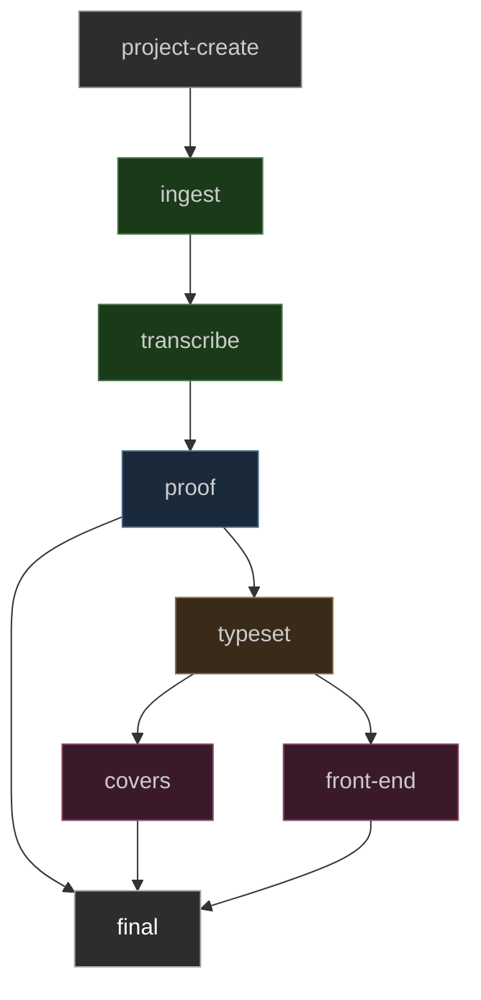

> I was in a Printing house in Hell & saw the method in which knowledge is transmitted from generation to generation.
>
> In the first chamber was a Dragon-Man, clearing away the rubbish from a caves mouth; within, a number of dragons were hollowing the cave,
>
> In the second chamber was a Viper folding round the rock & the cave, and others adorning it with gold silver and precious stones.
>
> In the third chamber was an Eagle with wings and feathers of air, he caused the inside of the cave to be infinite, around were numbers of Eagle like men, who built palaces in the immense cliffs.
>
> In the fourth chamber were Lions of flaming fire raging around & melting the metals into living fluids.
>
> In the fifth chamber were Unnam'd forms, which cast the metals into the expanse,
>
> There they were reciev'd by Men who occupied the sixth chamber, and took the forms of books & were arranged in libraries.
>
> — William Blake, _The Marriage of Heaven and Hell_

# Now You Will See

Texgraph is a staged publishing pipeline for serious literary production. It
takes a poetry collection from raw source material through transcription, proof,
and typesetting to production-grade print files — and, when the front-end stage
is complete, to e-reader formats as well. Each stage owns its own agents, skills,
tools, and truth standard. User approval gates every promotion.

The system is built to produce specific things: trade paperback PDFs typeset in
professional-grade LuaLaTeX, e-reader files calibrated to device screen sizes,
and the same collection body in multiple page geometries without re-authoring
content.

---

## What This Makes

### Print Formats

Every build produces a PDF/X-3 file via LuaLaTeX — print-vendor-ready,
color-profiled, with embedded OpenType fonts. The page geometry, type size,
margins, and leading are all parameterized in `collection.yaml` under
`render_config`. The same content directory can be compiled to different trim
sizes by changing those values.

**Common print geometries:**

| Name | Width | Height | Typical use |
|---|---|---|---|
| US Trade Paperback | 5.5 in | 8.5 in | Standard US poetry collection |
| A5 | 148 mm | 210 mm | European literary edition |
| UK B-format | 4.25 in | 6.875 in | UK trade, literary fiction |
| US Mass Market | 4.19 in | 6.75 in | Mass market paperback |
| Square Chapbook | 5.5 in | 5.5 in | Contemporary chapbook |
| US Letter (proofing) | 8.5 in | 11 in | Desktop draft review |

Set `draft_mode: true` to suppress PDF/X compliance overhead and speed up
iteration. Draft builds skip `pdfx` metadata; release builds include full XMP
metadata for print-on-demand and offset vendors.

### E-Reader Formats

E-reader output (EPUB 3, Kindle) is the intended product of the `front-end/`
stage. That stage is currently a stub — the content model, content parser, and
Jinja2 template infrastructure are all in place; what remains is the rendering
path that converts the same Markdown/YAML source into semantic HTML with CSS
tuned to device reflowable constraints.

Until that path exists, a PDF targeted to a 90 mm × 117 mm viewport (6-inch
e-ink screen) can stand in as a fixed-layout proof.

**E-reader target geometries (for PDF proofing):**

| Device class | Width | Height |
|---|---|---|
| 6" e-ink (Kindle, Kobo) | 90 mm | 117 mm |
| 7" e-ink (Kindle Oasis) | 107 mm | 143 mm |
| Tablet (iPad mini) | 134 mm | 195 mm |

---

## The Publishing Pipeline

### DAG Structure

The framework enforces a directed acyclic graph. Every job belongs to a stage.
No stage writes to another stage's artifacts without explicit user approval.

```
project-create
      │
      ▼
   ingest          ← source acquisition, provenance, PDF intake
      │
      ▼
 transcribe         ← poem text, source matter, volume planning
      │
      ▼
   proof            ← verification, correction, editorial review
      │
      ├─────────────────┐
      ▼                 ▼
  typeset           (proof → final is a direct path for
      │              short-form work without layout needs)
      ├────────────────────────┐
      ▼                        ▼
   covers                 front-end    ← e-reader, web, publication surfaces
      │                        │
      └──────────┬─────────────┘
                 ▼
              final             ← release packages, manifests, delivery
```



### Promotion Gates

Each DAG edge requires explicit user input before an artifact crosses it. The
system does not auto-promote. The table below shows what the user must approve
at each transition:

| Transition | Required User Decision |
|---|---|
| project-create → ingest | source selection, rights/provenance |
| ingest → transcribe | source naming, intake manifest approval |
| transcribe → proof | transcription policy, uncertain readings |
| proof → typeset | accepted corrections, proof status sign-off |
| typeset → covers | trim, type regime, interior proof approval |
| typeset → front-end | format target, output mode |
| covers/front-end → final | vendor format, visual direction, copy approval |
| → final | final release checklist sign-off |

---

## Agentic Workflow Assessment

### Architecture

The agent system has three tiers:

```
┌─────────────────────────────────────────────────────┐
│               ROOT ORCHESTRATOR                      │
│  AGENTS.md  —  decompose · classify · dispatch       │
│  Reads request → breaks into stage jobs → routes     │
└──────────────────────────┬──────────────────────────┘
                           │
         ┌─────────────────┼─────────────────┐
         ▼                 ▼                 ▼
  ┌────────────┐   ┌────────────┐   ┌────────────────┐
  │   STAGE    │   │   STAGE    │   │    STAGE       │
  │  AGENTS.md │   │  AGENTS.md │   │   AGENTS.md    │
  │  ingest    │   │ transcribe │   │ typeset / …    │
  └──────┬─────┘   └─────┬──────┘   └───────┬────────┘
         │               │                  │
    ┌────▼────┐     ┌────▼────┐        ┌────▼────┐
    │ skills/ │     │ skills/ │        │ skills/ │
    │ tools/  │     │ tools/  │        │ tools/  │
    └─────────┘     └─────────┘        └─────────┘
```

**Tier 1 — Root orchestrator** (`AGENTS.md`): Receives any request. Decomposes
it into one or more stage jobs. Assigns each job to exactly one stage. Does not
execute stage work; it routes.

**Tier 2 — Stage agents** (`<stage>/AGENTS.md`): Knows its stage's truth
standard, owns its artifacts, defines what user approval looks like before
promotion. Each is an independent contract.

**Tier 3 — Skills and tools** (`<stage>/skills/`, `<stage>/tools/`):
- Skills are repeatable instruction programs — judgment encoded for reuse
  (e.g., `typeset/skills/typesetting/SKILL.md` specifies the full typesetting
  regime: font selection, leading, margin calculation, stanza handling).
- Tools are deterministic scripts — mechanical execution with no judgment
  (e.g., `transcribe/tools/create_fletcher_subprojects.py`).

### Stage-by-Stage Assessment

**`ingest/`** — Source acquisition and provenance. Establishes what exists, where
it came from, and whether it can be used. The fletcher CLI (`fletcher archive`,
`fletcher pdf`) provides mechanical intake. Skills cover source-intake workflow.
This stage is the evidentiary foundation; nothing that happens downstream can
contradict it without explicit source evidence.

**`transcribe/`** — Poem text from source. The most labor-intensive stage. Skills
cover poem-transcription, source-matter handling, volume planning, and project
planning. The fletcher audit CLI (`fletcher audit`) provides machine-assisted
verification against source scans. Uncertain readings require user resolution
before promotion.

**`proof/`** — Two workflows in one: transcription verification (evidence-based,
neutral) and editorial review (voice-led, governed by `PERSONA.md`). The
persona boundary is sharp: editorial prose may surround the edition; source
text, YAML, manifests, and audits stay factual. This stage is where the
collection's argumentative frame is built.

**`typeset/`** — The most mechanically complex stage. The skills file specifies a
complete typesetting regime: font hierarchy, leading tables, margin systems,
verse environment handling, PDF/X compliance. Execution goes through the
`texgraph build` CLI, which chains: parse Markdown/YAML → render Jinja2 LaTeX
templates → compile LuaLaTeX → report. The render_config system allows the same
content to target multiple geometries.

**`covers/`** — Visual production stage. Currently a stub with AGENTS.md defining
the scope. No skills or tools yet. The Studio backend has cover models and a
covers router in place.

**`front-end/`** — Publication-facing deliverables: e-reader files, web
publication, static generation. Currently a stub. The intended output path
(EPUB 3, reflowable HTML) shares the same source content as the typeset stage;
the rendering target changes but the content model does not.

**`final/`** — Release packaging and delivery manifests. Currently a stub.
Receives only user-approved artifacts from upstream.

**`machinery/`** — Cross-stage infrastructure. Contains the full build system
(`texgraph`, `fletcher` CLIs), the Studio FastAPI backend, the React frontend,
tests, and shared infrastructure. This is where code lives; stages carry
instructions.

### Current Workflow Gaps

| Gap | Location | Notes |
|---|---|---|
| E-reader rendering path | `front-end/` | Content model ready; EPUB renderer not yet written |
| Multiple geometry presets | `typeset/` | Parameterized in render_config but no named presets |
| Promotion records | All stages | User approvals are honored but not formally recorded |
| Studio module-agents | `machinery/studio/` | Planned; backend/frontend scaffold in place |
| Stage chat | `machinery/studio/` | Not yet implemented |
| covers/ skills | `covers/` | AGENTS.md only; no workflows defined |
| final/ skills | `final/` | AGENTS.md only; no workflows defined |

---

## Output Formats: render_config Reference

Every `collection.yaml` file can include a `render_config` block controlling all
typographic and geometric parameters. The same Markdown source compiles to any
target by changing this block.

```yaml
render_config:
  fontsize: 11pt            # LaTeX font size (10pt, 11pt, 12pt)
  mainfont: EB Garamond     # OpenType font name (must be installed)
  paperwidth: 5.5in         # Page width
  paperheight: 8.5in        # Page height
  top_margin: 1in           # Top margin
  bottom_margin: 1in        # Bottom margin
  inner_margin: 1in         # Inner (gutter) margin
  outer_margin: 0.75in      # Outer margin
  line_spread: 1.1          # Leading multiplier
  stanza_skip: 1.0ex        # Vertical space between stanzas
```

**Named geometry examples:**

```yaml
# US Trade Paperback — standard poetry collection
paperwidth: 5.5in
paperheight: 8.5in
inner_margin: 0.875in
outer_margin: 0.75in

# A5 — European literary edition
paperwidth: 148mm
paperheight: 210mm
inner_margin: 22mm
outer_margin: 18mm

# Square chapbook
paperwidth: 5.5in
paperheight: 5.5in
top_margin: 0.75in
bottom_margin: 0.75in

# 6" e-reader PDF (fixed layout proof)
paperwidth: 90mm
paperheight: 117mm
fontsize: 9pt
top_margin: 6mm
bottom_margin: 6mm
inner_margin: 6mm
outer_margin: 6mm
```

---

## Getting Started

### Install

```powershell
# From repo root — install texgraph and fletcher CLIs
.\.venv\Scripts\pip.exe install -e .
```

Or with Make:

```powershell
make install
```

### Register a Project

Copy the workspace template and edit it:

```powershell
Copy-Item workspace.example.yaml workspace.yaml
```

```yaml
# workspace.yaml
projects:
  - id: my-collection
    path: projects/my-collection/typeset
    description: "My collection"
default_project: my-collection
```

### Build

```powershell
# Draft build (fast, skips PDF/X metadata)
.\.venv\Scripts\texgraph.exe build --project my-collection --draft

# Release build
.\.venv\Scripts\texgraph.exe build --project my-collection

# Watch mode — rebuilds on file changes
.\.venv\Scripts\texgraph.exe watch --project my-collection --draft

# List registered projects
.\.venv\Scripts\texgraph.exe list
```

### Studio

```powershell
# Launch the web UI (FastAPI + React, opens browser)
.\.venv\Scripts\texgraph.exe studio
```

### Editorial Tools

```powershell
# Inspect a source PDF
.\.venv\Scripts\fletcher.exe pdf info projects\<id>\ingest\raw\<file>.pdf

# Check transcription metadata
.\.venv\Scripts\fletcher.exe metadata projects\<id>\transcribe\volumes --check

# Run transcription audit against source
.\.venv\Scripts\fletcher.exe audit projects\<id>\transcribe\volumes\<volume>\books\<book>
```

---

## Example Project: spectra_poems

`spectra_poems` is a tracked example project in this repository. It contains
three poems forming a sequence called "Iberian Dreams": a Renaissance-inflected
sonnet, a dialogue poem mixing English and Spanish, and a lyric meditation on
distance and the image. The project is fully buildable and demonstrates the
content format, section structure, and render_config system.

**Project path:** `projects/spectra_poems/typeset/`

**Registered in:** `workspace.yaml`

### Build the Example

```powershell
.\.venv\Scripts\texgraph.exe build --project spectra_poems --draft
```

Output goes to `projects/spectra_poems/typeset/output/`.

### Content Structure

```
projects/spectra_poems/
└── typeset/
    ├── collection.yaml              ← collection metadata and render_config
    └── content/
        └── 01_iberian-dreams/
            ├── _meta.yaml           ← section label and order
            ├── 01_in-response-a-sonnet.md
            ├── 02_no-serrana.md
            └── 03_the-marques-dreams-of-her.md
```

### Poem File Format

Each poem is a Markdown file with YAML front matter:

```markdown
---
title: "In Response, A Sonnet"
type: poem
order: 1
---

Watch hunters draw the elephant to die,
in love with some false woman they have made,
...
```

Stanzas are separated by blank lines. The `type` field can be `poem`, `prose`,
`poem-cycle`, or `poem-screenplay`. The `order` field controls sequencing within
the section.

### The Poems

**"In Response, A Sonnet"** — A formal Petrarchan sonnet, octave and sestet, on
the Renaissance beast-fable of the elephant and the maiden: the animal drawn to
its death by the image of a woman it loves. The speaker aligns himself with the
animal not as pathos but as argument: this is what beauty does to wit.

**"No Serrana"** — Loose tercets and couplets. The serrana is an Iberian pastoral
figure, the cowherd girl encountered in the mountain pass. The poem refuses the
comparison of women to spring ("Loose habit. / Dead speech.") and lets the woman
speak for herself in both languages: _esa moza no quiere / saber nada de amores_.
She meant, in fact said: go back to your saddle.

**"The Marques Dreams of Her"** — A lyric in six stanzas. The image of the beloved
appears twice: as Dido at Carthage, as a woman buying carnations in California.
The dart that wounds also blesses. The poem moves through unearned pain toward a
provisional rest — "Having confessed, / I can almost rest."

---

## Repository Layout

```
AGENTS.md                 root orchestrator
PERSONA.md                editorial voice contract
workspace.example.yaml    workspace template (copy to workspace.yaml)
workspace.yaml            local workspace registration (gitignored)
Makefile                  build tasks

ingest/                   source acquisition stage
  AGENTS.md
  skills/

transcribe/               transcription stage
  AGENTS.md
  skills/
  tools/

proof/                    verification and editorial stage
  AGENTS.md
  skills/

typeset/                  layout and PDF production stage
  AGENTS.md
  skills/

covers/                   cover design stage
  AGENTS.md

front-end/                e-reader and publication stage
  AGENTS.md

final/                    release and delivery stage
  AGENTS.md

machinery/                CLIs, Studio, tests, shared infrastructure
  src/texgraph/           Markdown → LaTeX → PDF build system
  src/fletcher/           editorial and transcription helpers
  studio/backend/         FastAPI services (projects, builds, covers, previews)
  studio/frontend/        React + Vite + TypeScript studio interface
  tests/                  regression tests
  docs/                   technical reference

projects/                 local project workspaces
  spectra_poems/          tracked example project
  lift-wind-love-heat/    primary live collection (local content, gitignored)
```

---

## Stage Reference

### ingest/

Owns source acquisition, source naming, provenance records, PDF intake manifests.
Nothing downstream can contradict source evidence without a formal source
resolution.

Commands: `fletcher archive`, `fletcher pdf`, `fletcher scan`

### transcribe/

Owns poem text from source. Every transcription decision must be traceable to
source evidence. Uncertain readings are flagged and held for user resolution.

Commands: `fletcher metadata`, `fletcher pagemap`, `fletcher plan`

Skills: `poem-transcription`, `project-planning`, `source-matter`, `volume-planning`

### proof/

Two tracks: transcription verification (evidence-based, neutral) and editorial
review (governed by `PERSONA.md`). The persona boundary is the critical
discipline of this stage: editorial voice enters only when explicitly requested
and only in prose that surrounds the source text, never in it.

Commands: `fletcher audit`

Skills: `transcription-verification`, `persona-editorial`

### typeset/

Owns build inputs, layout policy, and interior production. The typesetting skill
defines a complete regime: font hierarchy, leading tables, margin systems, verse
environment handling. Builds run via `texgraph build`.

Commands: `texgraph build`, `texgraph watch`, `texgraph new poem`

Skills: `typesetting` (see `typeset/skills/typesetting/SKILL.md` for the full
typesetting regime specification)

### covers/, front-end/, final/

Currently defined by AGENTS.md contracts. Skills and mechanical tools are the
next build target for each.

---

## Machinery

### texgraph CLI

```
texgraph build     Markdown + YAML → LaTeX → PDF
texgraph watch     Auto-rebuild on file changes
texgraph list      Show workspace projects
texgraph new poem  Scaffold a new poem file
texgraph studio    Launch Studio (FastAPI + React)
```

### fletcher CLI

```
fletcher archive   PDF/file acquisition
fletcher audit     Transcription verification against source
fletcher metadata  Metadata validation
fletcher pagemap   Page mapping utilities
fletcher pdf       PDF inspection
fletcher plan      Project planning
fletcher scan      Source scanning
```

### Studio

The Studio is a FastAPI backend with a React/Vite/TypeScript frontend. It
provides a web interface for project navigation, poem editing, build triggering,
and preview generation. Launch with `texgraph studio`.

API routes: `/api/projects`, `/api/projects/{id}/sections`,
`/api/projects/{id}/sections/{sid}/poems`, `/api/projects/{id}/build`,
`/api/projects/{id}/preview`, `/api/agent`, `/api/covers`

### Key Source Files

| File | Purpose |
|---|---|
| `machinery/src/texgraph/cli.py` | All CLI commands (774 lines) |
| `machinery/src/texgraph/config.py` | CollectionConfig, WorkspaceConfig, ProjectRef |
| `machinery/src/texgraph/parser.py` | Markdown/YAML poem parsing |
| `machinery/src/texgraph/renderer.py` | Jinja2 → LaTeX rendering with smart escaping |
| `machinery/src/texgraph/compiler.py` | LuaLaTeX subprocess invocation and log parsing |
| `machinery/src/texgraph/templates/collection.tex.jinja2` | Main document template |
| `machinery/src/texgraph/templates/base_preamble.tex.jinja2` | LaTeX preamble |
| `machinery/studio/backend/app/main.py` | FastAPI entry point |
| `machinery/studio/frontend/src/` | React components |

---

## Current Standing

**Built and functional:**
- Complete CLI (`texgraph build`, `watch`, `list`, `new poem`, `studio`)
- Markdown/YAML poem parsing (poem, prose, poem-cycle, poem-screenplay types)
- Jinja2 LaTeX rendering with smart-quote and escape handling
- LuaLaTeX compiler with log parsing and error reporting
- Workspace/project registration and resolution
- FastAPI Studio backend with full project/poem/section/build API
- React/Vite/TypeScript Studio frontend scaffold
- Full stage AGENTS.md contracts (ingest, transcribe, proof, typeset, covers, front-end, final)
- Typesetting skill with complete typographic regime
- Example project: spectra_poems (tracked, buildable)

**Next work:**
- E-reader rendering path in `front-end/` (EPUB 3 from existing content model)
- Named format presets in render_config (trade, A5, chapbook, e-reader)
- Promotion records: formal artifact of user approval at each stage gate
- Studio module-agents: per-stage interactive agents in the web interface
- Stage chat: conversational access to each stage from Studio
- covers/ skills and tools
- final/ skills and packaging tools
- Smoke test coverage across build/watch/list/new-poem flows

The sixth chamber receives books. Build toward that.
