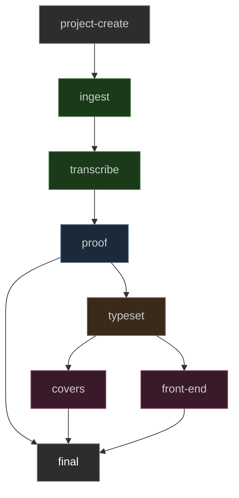
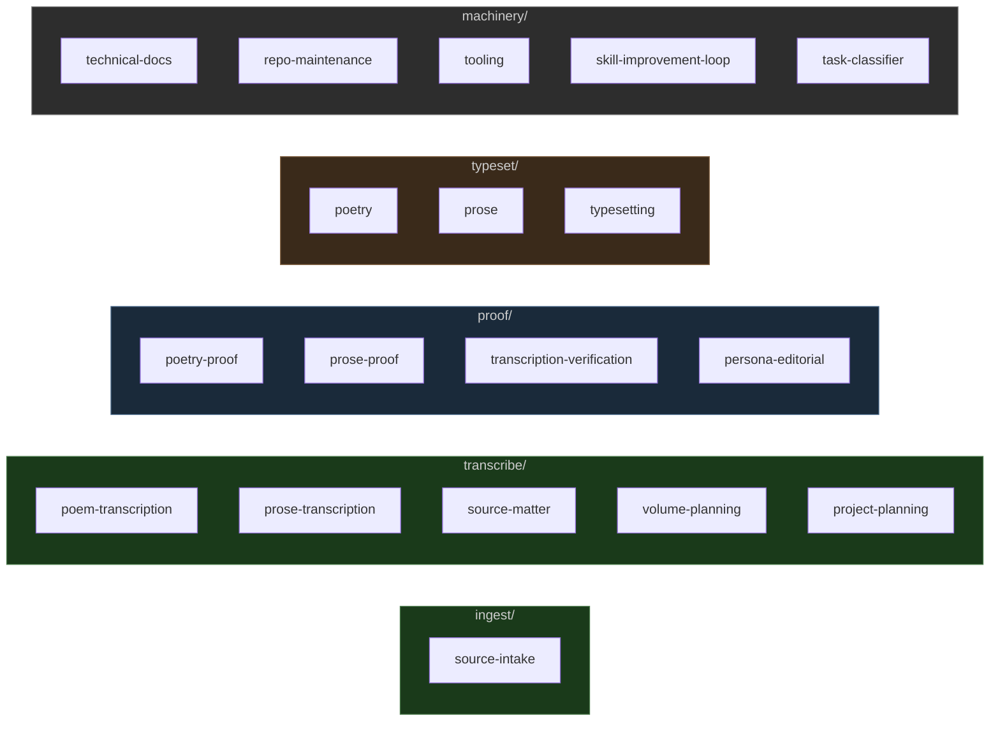

> I was in a Printing house in Hell & saw the method in which knowledge is transmitted from generation to generation.
>
> In the first chamber was a Dragon-Man, clearing away the rubbish from a caves mouth; within, a number of dragons were hollowing the cave,
>
> In the second chamber was a Viper folding round the rock & the cave, and others adorning it with gold silver and precious stones.
>
> In the third chamber was an Eagle with wings and feathers of air, he caused the inside of the cave to be infinite, around were numbers of Eagle like men, who built palaces in the immense cliffs.
>
> In the fourth chamber were Lions of flaming fire raging around & melting the metals into living fluids.
>
> In the fifth chamber were Unnam'd forms, which cast the metals into the expanse,
>
> There they were reciev'd by Men who occupied the sixth chamber, and took the forms of books & were arranged in libraries.
>
> — William Blake, _The Marriage of Heaven and Hell_

# Now You Will See

Texgraph is a staged publishing pipeline for serious literary production. It
takes a poetry collection from raw source material through transcription, proof,
and typesetting to production-grade print files — and, when the front-end stage
is complete, to e-reader formats as well. Each stage owns its own agents, skills,
tools, and truth standard. User approval gates every promotion.

The system is built to produce specific things: trade paperback PDFs typeset in
professional-grade LuaLaTeX, e-reader files calibrated to device screen sizes,
and the same collection body in multiple page geometries without re-authoring
content.

**New here?** Start with [QUICKSTART.md](QUICKSTART.md) for a linear path from install to first PDF.

---

## Who This Is For

Texgraph is for **poets, translators, and small press editors** who want
publication-grade output without InDesign and without ceding editorial control
to a platform.

The prerequisite floor is: you can run a Python virtualenv, install a TeX
distribution, and edit YAML. You do not need to know LaTeX — the build system
handles it. You do need to be comfortable in a terminal.

**This is not the right tool if:**
- You want a GUI-first experience from day one (Studio is planned but not finished)
- You need EPUB or e-reader output now (the front-end rendering path is not yet built)
- You are unwilling to install TeX Live (~4 GB)

**This is the right tool if:**
- You are producing a print collection and want PDF/X-3 output with professional typography
- You are working from scanned historical sources and need a transcription + proof pipeline
- You want the same collection body to target multiple trim sizes without re-authoring
- You are working with an AI assistant and want a structured, stage-gated workflow

The workflow is AI-assisted but not AI-driven. The AI orchestrates and executes
within stage contracts; you approve every promotion between stages.

---

## Prerequisites

| Requirement | Version | Required for | Notes |
|---|---|---|---|
| Python | 3.11+ | Everything | |
| TeX Live (full) or MiKTeX | Current | Build commands | Full scheme only — minimal scheme will fail |
| System OpenType font | Any | Build commands | EB Garamond used by example project |
| poppler-utils | Any | `pdf`, `audit`, `scan`, `archive` commands | Not needed for build/watch/list |
| Node.js | 18+ | Studio frontend | Not needed for CLI builds |

See [QUICKSTART.md](QUICKSTART.md) for installation steps, common errors, and first-build walkthrough.

---

## What This Makes

### Print Formats

Every build produces a PDF/X-3 file via LuaLaTeX — print-vendor-ready,
color-profiled, with embedded OpenType fonts. The page geometry, type size,
margins, and leading are all parameterized in `collection.yaml` under
`render_config`. The same content directory can be compiled to different trim
sizes by changing those values.

**Common print geometries:**

| Name | Width | Height | Typical use |
|---|---|---|---|
| US Trade Paperback | 5.5 in | 8.5 in | Standard US poetry collection |
| A5 | 148 mm | 210 mm | European literary edition |
| UK B-format | 4.25 in | 6.875 in | UK trade, literary fiction |
| Square Chapbook | 5.5 in | 5.5 in | Contemporary chapbook |
| US Letter (proofing) | 8.5 in | 11 in | Desktop draft review |

Set `draft_mode: true` to suppress PDF/X compliance overhead and speed up
iteration. Draft builds skip `pdfx` metadata; release builds include full XMP
metadata for print-on-demand and offset vendors.

### E-Reader Formats

E-reader output (EPUB 3, Kindle) is the intended product of the `front-end/`
stage. That stage is currently a stub — the content model, parser, and Jinja2
template infrastructure are in place; what remains is the rendering path that
converts the same Markdown/YAML source into semantic HTML with CSS tuned to
device reflowable constraints.

Until that path exists, a PDF targeted to a 90 mm × 117 mm viewport can stand
in as a fixed-layout proof.

**E-reader target geometries (for PDF proofing):**

| Device class | Width | Height |
|---|---|---|
| 6" e-ink (Kindle, Kobo) | 90 mm | 117 mm |
| 7" e-ink (Kindle Oasis) | 107 mm | 143 mm |
| Tablet (iPad mini) | 134 mm | 195 mm |

---

## The Publishing Pipeline

### DAG Structure

The framework enforces a directed acyclic graph. Every job belongs to a stage.
No stage writes to another stage's artifacts without explicit user approval.

```
project-create
      │
      ▼
   ingest          ← source acquisition, provenance, PDF intake
      │
      ▼
 transcribe         ← poem text, source matter, volume planning
      │
      ▼
   proof            ← verification, correction, editorial review
      │
      ├─────────────────┐
      ▼                 ▼
  typeset           (proof → final is a direct path for
      │              short-form work without layout needs)
      ├────────────────────────┐
      ▼                        ▼
   covers                 front-end    ← e-reader, web, publication surfaces
      │                        │
      └──────────┬─────────────┘
                 ▼
              final             ← release packages, manifests, delivery
```



### Promotion Gates

Each DAG edge requires explicit user input before an artifact crosses it. The
system does not auto-promote.

| Transition | Required User Decision |
|---|---|
| project-create → ingest | source selection, rights/provenance |
| ingest → transcribe | source naming, intake manifest approval |
| transcribe → proof | transcription policy, uncertain readings |
| proof → typeset | accepted corrections, proof status sign-off |
| typeset → covers | trim, interior proof approval |
| typeset → front-end | format target, output mode |
| covers/front-end → final | vendor format, visual direction, copy approval |

Gates are enforced by `PROMOTION.yaml` files at `projects/<id>/<stage>/PROMOTION.yaml`.
`texgraph verify <stage>` reads the upstream gate and exits non-zero if preconditions
are unmet. See ONTOLOGY.md § Data Schemas for full schema reference.

### Pipeline Gate Implementation

- [x] Step 1: PROMOTION.yaml schemas defined in ONTOLOGY.md
- [x] Step 2: `texgraph verify <stage>` — precondition enforcement (`promotions.py` + CLI)
- [x] Step 3: `texgraph ingest rename` — first concrete stage gate (stable naming, provenance record, ingest PROMOTION.yaml)
- [ ] Step 4: `texgraph proof-build` — proof PDF generation command
- [ ] Step 5: `texgraph promote <stage>` — write approved PROMOTION.yaml at each gate
- [ ] Step 6: Style token extraction (typeset → covers handshake payload)
- [ ] Step 7: Cover payload reader (covers stage reads typeset style tokens)

---

## Agentic Workflow Architecture

### Three-Layer Context System

The agent framework has three layers — root dispatcher, stage contracts, and
on-demand skills — each scoped to what it needs to know:

```
┌──────────────────────────────────────────────────────────────┐
│                       ONTOLOGY.md                             │
│   Comprehensive repo reference: directory taxonomy, all       │
│   schemas, command surface, dependency map, key invariants    │
│   Read by agents when they need to navigate the repo.        │
└──────────────────────────────────────────────────────────────┘
                              │
         ┌────────────────────┼──────────────────────┐
         ▼                    ▼                       ▼
┌─────────────────┐  ┌────────────────┐  ┌──────────────────────┐
│    AGENTS.md    │  │  <stage>/      │  │  <stage>/            │
│  Root dispatch  │  │  AGENTS.md     │  │  AGENTS.md           │
│  Routing table  │  │  Contract:     │  │  Contract:           │
│  DAG summary    │  │  gate · skills │  │  gate · skills       │
│  Update loops   │  │  tools         │  │  tools               │
└─────────────────┘  └───────┬────────┘  └──────────┬───────────┘
                             │                       │
                   ┌─────────┴──────────┐    ┌──────┴──────┐
                   ▼                    ▼    ▼             ▼
             SKILL.md            SKILL.md  SKILL.md   SKILL.md
             (loaded             (loaded   (loaded    (loaded
             on demand)          on demand) on demand) on demand)
```

**ONTOLOGY.md** is the map. Agents read it when they need repo-wide context —
directory shape, file schemas, command surface, invariants. It is not read on
every request, only when the task requires structural navigation.

**Root `AGENTS.md`** is the dispatcher. It classifies the request by job type
first, resolves composite paths, then routes to the correct stage. It does not
execute stage work.

**Stage `AGENTS.md`** files are lean contracts (~40–60 lines each). Each stage
knows its inputs, its outputs, its user gate, which skills to load, and which
commands to use. They do not repeat what is in ONTOLOGY.md.

**SKILL.md files** are on-demand workflow programs. They are loaded only when
the task matches. A verse proof task loads `proof/skills/poetry-proof/SKILL.md`;
a prose proof task loads `proof/skills/prose-proof/SKILL.md`. Skills encode
judgment for reuse without bloating every request's context.

### Job Classification

Every request is classified before it is routed. The dispatcher recognizes four
job types:

| Job type | Signals | Produces |
|---|---|---|
| `pipeline/<stage>` | Changes or produces an artifact under `projects/<id>/` | Stage output + PROMOTION.yaml |
| `research` | Finding or evaluating sources — not yet committing them | Research note (optional) |
| `conversation` | Question, planning discussion, feedback — no artifact target | Answer or decision |
| `tooling` | Change to CLI, infrastructure, docs, or skills | Code or doc change |

Tasks can be **composite** — a single request can require more than one job type
in sequence:

| Path | Example |
|---|---|
| `pipeline/<stage>` | "Transcribe volume 1" — all inputs known, execute directly |
| `conversation → pipeline` | "I want to ingest a file" — clarify inputs, then execute |
| `research → pipeline/ingest` | "Find a public domain edition of X and add it" |
| `tooling → pipeline` | "Fix the verify command and run it on this project" |
| `conversation` | "How should I handle uncertain readings?" — answer only, no execution |

The `task-classifier` skill in `machinery/skills/` provides a decision tree for
ambiguous cases. See `ONTOLOGY.md § Job Classification` for the full taxonomy and
artifact contracts.

### Skill Map



**Content-type routing within stages:**

| Content type | Transcribe skill | Proof skill | Typeset skill |
|---|---|---|---|
| Verse (lyric, formal, free) | `poem-transcription` | `poetry-proof` | `poetry` |
| Prose (preface, essay, fiction) | `prose-transcription` | `prose-proof` | `prose` |
| Source paratext (dedications, colophons) | `source-matter` | `transcription-verification` | `prose` |
| Infrastructure / docs | — | — | `technical-docs` (machinery) |

### Ontology Update Loop

The `ontology_check.py` tool tracks which repo changes require `ONTOLOGY.md`
review. After any task that changes directory structure, file formats, CLI
commands, data schemas, or pipeline edges:

```powershell
.\.venv\Scripts\python.exe machinery\tools\ontology_check.py
```

The tool compares the current git state against a stored baseline, categorizes
changed files by impact area, and reports which sections of ONTOLOGY.md to
review. When review is complete:

```powershell
.\.venv\Scripts\python.exe machinery\tools\ontology_check.py --save-baseline
```

### Stage-by-Stage Assessment

**`ingest/`** — Source acquisition and provenance. Establishes what exists, what
can be used, and where it came from. The `texgraph archive` and `texgraph pdf`
commands provide mechanical intake. Nothing downstream can contradict source
evidence without a formal source resolution.

**`transcribe/`** — Poem and prose text from source. The most labor-intensive
stage. Five skills cover the full range: verse transcription, prose/paratext
transcription, source matter, volume planning, and project planning. The `texgraph
audit` command provides machine-assisted verification. Uncertain readings require
user resolution before proof promotion.

**`proof/`** — Four skills in two tracks. The verification track (`poetry-proof`,
`prose-proof`, `transcription-verification`) is evidence-based and neutral. The
editorial track (`persona-editorial`) is voice-led and governed by `PERSONA.md`.
The persona boundary is the critical discipline: editorial prose may surround
the edition; source text, YAML, manifests, and audits stay factual.

**`typeset/`** — Three skills: `poetry` (stanza environment, indentation, cycles),
`prose` (paragraph convention, blockquote, mixed content), and `typesetting` (render_config,
build verification, PDF/X compliance, vendor submission). Builds chain: parse
Markdown/YAML → render Jinja2 LaTeX → compile LuaLaTeX → report. The same
content directory can target any geometry by changing `render_config`.

**`covers/`** — Visual production stage. AGENTS.md contract in place; skills and
tools are the next build target. Studio backend has cover models and router.
Gate: requires final PROMOTION.yaml with `cover_unlock.unlocked: true`.

**`front-end/`** — Two separate things share this name:

*Pipeline stage* (`front-end/`) — Publication-facing output: EPUB 3, web, static assets.
AGENTS.md contract in place; no skills or tools yet. The core missing piece is an
EPUB 3 renderer: the parser and content model are already shared with typeset, so
adding EPUB means a new Jinja2 render target (XHTML + OPF + NCX + CSS) and a
`texgraph epub` CLI command, not a content model change. Estimated: 2–3 days of
focused work. Needs `texgraph verify front-end` gate added to `promotions.py`.

*Studio frontend* (`machinery/studio/frontend/`) — 47-file React/Vite/TypeScript
application with four editor views (cards, graph, build, covers), streaming build
and agent hooks, and a full API client layer. More built than it appears. Primary
gaps: no pipeline gate visibility (no PROMOTION.yaml status display), no
classification-aware agent dispatch, and the graph view (DAG with live stage status)
is the least complete piece.

**`final/`** — Release packaging. Receives only user-approved artifacts from
upstream. AGENTS.md contract in place. Writes `cover_unlock.unlocked: true` to
its PROMOTION.yaml to gate the covers stage.

**`machinery/`** — Cross-stage infrastructure. Five skills: `technical-docs`
(ONTOLOGY.md protocol, doc conventions), `repo-maintenance`, `tooling`,
`skill-improvement-loop`, and `task-classifier` (job type decision tree for
ambiguous requests). Contains the full CLI, Studio FastAPI backend, React
frontend, and shared infrastructure.

### Current Workflow Gaps

| Gap | Location | Status |
|---|---|---|
| EPUB 3 renderer | `front-end/` | Content model + parser ready; render target not written |
| `texgraph promote <stage>` | All stages | verify works; promote (writes approved gate) not yet built |
| `texgraph proof-build` | `proof/` | Proof PDF generation command not yet built |
| Studio pipeline gate visibility | `machinery/studio/frontend/` | No PROMOTION.yaml status display; no verify/promote UI |
| Studio graph view | `machinery/studio/frontend/` | DAG with live stage status is least complete view |
| Named format presets | `typeset/` | render_config parameterized; no preset registry |
| covers/ skills and tools | `covers/` | AGENTS.md only |
| final/ skills and packaging | `final/` | AGENTS.md only |
| Test coverage | `machinery/tests/` | 3 files; promotions.py, verify, ingest rename untested |

---

## Output Formats: render_config Reference

Every `collection.yaml` includes a `render_config` block controlling all
typographic and geometric parameters. The same Markdown source compiles to any
target by changing this block.

```yaml
render_config:
  fontsize: 11pt            # LaTeX font size (10pt, 11pt, 12pt)
  mainfont: EB Garamond     # OpenType font name (must be installed)
  paperwidth: 5.5in         # Page width
  paperheight: 8.5in        # Page height
  top_margin: 1in
  bottom_margin: 1in
  inner_margin: 1in         # Inner (gutter) margin
  outer_margin: 0.75in      # Outer margin
  line_spread: 1.1          # Leading multiplier
  stanza_skip: 1.2ex        # Vertical space between stanzas
```

**Named geometry examples:**

```yaml
# US Trade Paperback — standard poetry collection
paperwidth: 5.5in
paperheight: 8.5in
inner_margin: 0.875in
outer_margin: 0.75in

# A5 — European literary edition
paperwidth: 148mm
paperheight: 210mm
inner_margin: 22mm
outer_margin: 18mm

# Square chapbook
paperwidth: 5.5in
paperheight: 5.5in
top_margin: 0.75in
bottom_margin: 0.75in

# 6" e-reader PDF (fixed layout proof)
paperwidth: 90mm
paperheight: 117mm
fontsize: 9pt
top_margin: 6mm
bottom_margin: 6mm
inner_margin: 6mm
outer_margin: 6mm
```

---

## Getting Started

See [QUICKSTART.md](QUICKSTART.md) for a full walkthrough: prerequisites,
install, first build, and common errors.

### Short path

```powershell
python -m venv .venv
.\.venv\Scripts\pip.exe install -e .
Copy-Item workspace.example.yaml workspace.yaml
.\.venv\Scripts\texgraph.exe build --project spectra_poems --draft
```

### Studio (optional)

```powershell
.\.venv\Scripts\pip.exe install -e ".[studio]"
.\.venv\Scripts\texgraph.exe studio
```

`fletcher` is a compatibility alias for `texgraph`. Both entrypoints are identical.

---

## Example Project: spectra_poems

`spectra_poems` is a tracked example project. It contains three poems forming a
sequence called "Iberian Dreams": a Renaissance-inflected sonnet, a dialogue poem
mixing English and Spanish, and a lyric meditation on distance and the image.

**Build it:**

```powershell
.\.venv\Scripts\texgraph.exe build --project spectra_poems --draft
```

Output goes to `projects/spectra_poems/typeset/output/`.

### Content Structure

```
projects/spectra_poems/
└── typeset/
    ├── collection.yaml              ← collection metadata and render_config
    └── content/
        └── 01_iberian-dreams/
            ├── _meta.yaml           ← section label and order
            ├── 01_in-response-a-sonnet.md
            ├── 02_no-serrana.md
            └── 03_the-marques-dreams-of-her.md
```

### Poem File Format

```markdown
---
title: "In Response, A Sonnet"
type: poem
order: 1
---

Watch hunters draw the elephant to die,
    in love with some false woman they have made,
...
```

Stanzas are separated by blank lines. Leading spaces produce indentation in the
verse environment. The `type` field can be `poem`, `prose`, `poem-cycle`, or
`poem-screenplay`.

### The Poems

**"In Response, A Sonnet"** — A formal Petrarchan sonnet, octave and sestet, on
the Renaissance beast-fable of the elephant and the maiden: the animal drawn to
its death by the image of a woman it loves. The speaker aligns himself with the
animal not as pathos but as argument: this is what beauty does to wit.

**"No Serrana"** — Loose tercets and couplets. The serrana is an Iberian pastoral
figure, the cowherd girl encountered in the mountain pass. The poem refuses the
comparison of women to spring ("Loose habit. / Dead speech.") and lets the woman
speak for herself in both languages: _esa moza no quiere / saber nada de amores_.

**"The Marques Dreams of Her"** — A lyric in six stanzas. The image of the beloved
appears twice: as Dido at Carthage, as a woman buying carnations in California.
The poem moves through unearned pain toward a provisional rest — "Having confessed,
/ I can almost rest."

---

## Repository Layout

```
ONTOLOGY.md               comprehensive repo reference (schemas, commands, invariants)
AGENTS.md                 root dispatcher (classify → route, pipeline + non-pipeline)
HANDOFF.md                context document for session continuity and model handoff
PERSONA.md                editorial voice contract template
workspace.example.yaml    workspace template (copy to workspace.yaml)
workspace.yaml            local workspace registration (gitignored)
pyproject.toml            Python package, dependencies, scripts
requirements.txt          consolidated pip manifest
Makefile                  build task shortcuts

ingest/                   source acquisition stage
  AGENTS.md               stage contract
  skills/
    source-intake/        source PDF verification and provenance

transcribe/               transcription stage
  AGENTS.md
  skills/
    poem-transcription/   verse transcription from scan
    prose-transcription/  prose and paratext transcription
    source-matter/        front/back matter: dedications, colophons, etc.
    volume-planning/      poem order, page maps, batch planning
    project-planning/     multi-volume publication plans

proof/                    verification and editorial stage
  AGENTS.md
  skills/
    poetry-proof/         line-break, stanza, indentation verification
    prose-proof/          paragraph integrity, type-tag, punctuation
    transcription-verification/  cross-file status and metadata audit
    persona-editorial/    editorial voice review (load PERSONA.md first)

typeset/                  layout and PDF production stage
  AGENTS.md
  skills/
    poetry/               verse layout: stanza_skip, cycles, long lines
    prose/                prose layout: paragraphs, blockquotes, headings
    typesetting/          render_config reference, build verification, vendor checks

covers/                   cover design stage
  AGENTS.md

front-end/                e-reader and publication stage
  AGENTS.md

final/                    release and delivery stage
  AGENTS.md

machinery/                CLIs, Studio, tests, shared infrastructure
  src/texgraph/           Markdown → LaTeX → PDF build system
  src/fletcher/           compatibility shim (alias → texgraph.cli:app)
  studio/backend/         FastAPI services (projects, builds, covers, agent)
  studio/frontend/        React + Vite + TypeScript studio interface
  tests/                  regression test suite
  docs/                   technical reference documents
  skills/
    technical-docs/       ONTOLOGY.md protocol, doc conventions
    repo-maintenance/     repo structure, git hygiene
    tooling/              CLI and build tool development
    skill-improvement-loop/  end-of-task skill review
  tools/
    ontology_check.py     git-diff based ONTOLOGY.md change tracker

projects/                 local project workspaces (gitignored)
  spectra_poems/          tracked example project (in git)
```

---

## CLI Reference

`texgraph` and `fletcher` are aliases for the same CLI. Both are valid
entrypoints; prefer `texgraph` in new scripts.

### Build and workspace

| Command | What it does |
|---|---|
| `texgraph build [--project <id>] [--draft]` | Parse → render → compile PDF |
| `texgraph watch [--project <id>]` | Auto-rebuild on file changes |
| `texgraph list` | List registered projects |
| `texgraph new poem "Title" [--section <id>]` | Scaffold a poem file |
| `texgraph studio` | Launch FastAPI + React Studio |

### Pipeline gates

| Command | What it does |
|---|---|
| `texgraph verify <stage> [--project <id>]` | Check upstream PROMOTION.yaml; exits 0 on pass, 1 on fail with issues listed |
| `texgraph ingest rename <file> --author A --year Y --title T` | Rename source to stable name, write provenance record, update ingest PROMOTION.yaml |

### Editorial and source

| Command | What it does |
|---|---|
| `texgraph pdf info <pdf>` | Metadata via pdfinfo |
| `texgraph pdf text <pdf> --first N --last N` | Extract text via pdftotext |
| `texgraph pdf render <pdf> --first N --last N --prefix P` | Pages to PNG |
| `texgraph archive files <identifier>` | List Internet Archive files |
| `texgraph archive download <id> <file> <dest>` | Download from IA |
| `texgraph audit <volume>` | Audit transcription book directory |
| `texgraph metadata <target> [--write] [--check]` | Book.json metadata |
| `texgraph page-map --offset N --printed "<ranges>"` | Page number mapping |
| `texgraph plan <document> [--check]` | Plan heading structure |
| `texgraph scan <target> --output <path>` | PDF front/back matter scan |

### Studio API (default: http://localhost:8765)

| Route | Purpose |
|---|---|
| `GET /api/projects` | List workspace projects |
| `POST /api/projects` | Create a project |
| `GET /api/projects/{id}/sections/{sid}/poems` | List poems in section |
| `POST /api/projects/{id}/build` | Trigger build |
| `GET /api/projects/{id}/preview` | Generate preview |
| `POST /api/agent` | Agent endpoints |
| `GET/POST /api/covers` | Cover management |

---

## Key Source Files

| File | Purpose |
|---|---|
| `machinery/src/texgraph/cli.py` | All CLI commands |
| `machinery/src/texgraph/promotions.py` | PROMOTION.yaml I/O and stage precondition checkers |
| `machinery/src/texgraph/config.py` | CollectionConfig, WorkspaceConfig, ProjectRef |
| `machinery/src/texgraph/parser.py` | Markdown/YAML poem parsing |
| `machinery/src/texgraph/renderer.py` | Jinja2 → LaTeX rendering with smart escaping |
| `machinery/src/texgraph/compiler.py` | LuaLaTeX invocation and log parsing |
| `machinery/src/texgraph/templates/collection.tex.jinja2` | Main document template |
| `machinery/src/texgraph/templates/base_preamble.tex.jinja2` | LaTeX preamble |
| `machinery/studio/backend/app/main.py` | FastAPI entry point |
| `machinery/tools/ontology_check.py` | ONTOLOGY.md change tracker |
| `ONTOLOGY.md` | Comprehensive repo reference |

---

## Current Standing

### Project Assessments

**Technical completeness (61/100):**

| Axis | Score |
|---|---|
| Installability / first run | 7/10 |
| Core functionality | 7/10 |
| Documentation quality | 8/10 |
| Test coverage | 3/10 |
| CLI ergonomics | 6/10 |
| Architectural clarity | 8/10 |
| Pipeline completeness | 5/10 |
| AI/agent workflow quality | 8/10 |
| Error handling | 5/10 |
| Production readiness | 4/10 |

**Value (74/100):**

| Axis | Score |
|---|---|
| Problem clarity | 8/10 |
| Addressable audience | 5/10 |
| Differentiation | 8/10 |
| Workflow fit | 7/10 |
| Intellectual integrity | 9/10 |
| AI integration model | 8/10 |
| Extensibility | 7/10 |
| Long-term preservation value | 8/10 |
| Switching cost / stickiness | 6/10 |
| Conceptual coherence | 8/10 |

The gap between value (74) and completeness (61) is the key number: the concept is stronger than the current implementation. Test coverage (3/10) and production readiness (4/10) are the lowest technical axes and the highest-leverage targets. Intellectual integrity (9/10) and architectural clarity (8/10) are the strongest axes and should be preserved as the remaining work is built.

**Built and functional:**
- Complete CLI: `texgraph build`, `watch`, `list`, `new poem`, `studio`, plus
  full editorial suite (`pdf`, `archive`, `audit`, `metadata`, `page-map`, `plan`, `scan`)
- Job classification layer: pipeline / research / conversation / tooling with composite path routing
- `task-classifier` skill: decision tree for ambiguous job types
- Pipeline gate commands: `texgraph verify <stage>` and `texgraph ingest rename`
- `promotions.py`: PROMOTION.yaml I/O and per-stage precondition checkers
- `fletcher` compatibility alias pointing to the same CLI
- Markdown/YAML poem parsing (`poem`, `prose`, `poem-cycle`, `poem-screenplay`)
- Jinja2 LaTeX rendering with smart-quote and escape handling
- LuaLaTeX compiler with log parsing and error reporting
- Workspace/project registration and resolution
- FastAPI Studio backend with full project/poem/section/build/covers API
- React/Vite/TypeScript Studio frontend scaffold
- ONTOLOGY.md: comprehensive repo reference (schemas, commands, invariants, directory taxonomy)
- 17 skills across all active stages, organized by content type (verse/prose/paratext)
- `ontology_check.py`: git-diff based change tracker with baseline management
- `pyproject.toml` studio optional-dependency group (`pip install -e ".[studio]"`)
- Example project `spectra_poems` (tracked, buildable, three poems)

**Next work:**
- `texgraph promote <stage>` — write approved PROMOTION.yaml (pipeline gate step 5)
- `texgraph proof-build` — proof PDF generation command (pipeline gate step 4)
- Style token extraction and cover payload reader (pipeline gate steps 6–7)
- E-reader rendering path in `front-end/` (EPUB 3 from existing content model)
- Named format presets in render_config (trade, A5, chapbook, e-reader)
- Studio module-agents: per-stage interactive agents in the web interface
- covers/ skills and tools
- final/ skills and packaging tools
- Smoke test coverage across build/watch/list/new-poem flows

The sixth chamber receives books. Build toward that.
